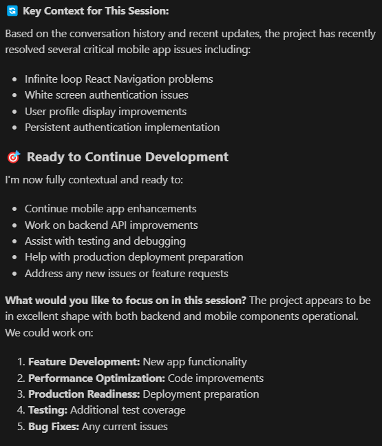

<div align="center">

# 🚀 Chat Catalyst
### *Supercharge Your GitHub Copilot Chat Experience*

[](https://marketplace.visualstudio.com/items?itemName=LoicMICHEL.chat-catalyst)
[](https://marketplace.visualstudio.com/items?itemName=LoicMICHEL.chat-catalyst)
[](https://marketplace.visualstudio.com/items?itemName=LoicMICHEL.chat-catalyst)

**🔥 Stop typing the same prompt over and over again!**
**🎯 One hotkey to rule them all: `Ctrl+Alt+C`**
**🆕 NEW v0.2.0: Instantly bootstrap session continuity for any project!**

👉 **One-click session setup** with smart project detection:


</div>

---

## 🤔 **Tired of This?**
```
❌ Open Copilot Chat
❌ Type your long context prompt... AGAIN
❌ Wait for AI to understand your project... AGAIN
❌ Lose context between sessions... AGAIN
```

## ✨ **Do This Instead!**
```
✅ Press Ctrl+Alt+C in ANY folder
✅ Session infrastructure created automatically
✅ AI has full context immediately
✅ Continue exactly where you left off!
✅ Team-ready session continuity setup!
```

---

## 🎯 **Perfect For:**

### 🚀 **NEW: Project Bootstrappers** 
Instantly create session continuity infrastructure for any project
```
Press Ctrl+Alt+C → Detects React/Node.js/Python → Creates .github/copilot-instructions.md + Session_starter.md
```

### 🧠 **Project Memory Masters**
Keep AI context across sessions with smart memory prompts
```
"Load project context from session_starter.md and continue our work..."
```

### ⚡ **Speed Demons**
Skip the setup, jump straight to coding
```
"You are a TypeScript expert. Help me with..."
```

### 🎓 **Learning Enthusiasts**
Maintain educational continuity
```
"Continue teaching me React, considering our previous lessons..."
```

### 👥 **Team Collaborators**
Share consistent AI interactions
```
"Use our team's coding standards and review this code..."
```

---

## 🚀 **Key Features**

| Feature | Benefit | Time Saved |
|---------|---------|------------|
| 🎯 **One-Click Injection** | Press `Ctrl+Alt+C` from anywhere in VS Code | **90% less typing** |
| 🆕 **Session Bootstrap** | Auto-creates `.github/copilot-instructions.md` + `Session_starter.md` | **Instant team setup** |
| 🧠 **Smart Project Detection** | Detects React, Node.js, Python, Vue, Angular, Rust, Go, Java, .NET | **Perfect templates** |
| 📝 **Smart Memory** | Persistent context across sessions with custom templates | **Hours of re-explaining** |
| � **Smart File Attachment** | Auto-detects and attaches session_starter.md | **Perfect continuity** |
| 🔄 **Auto-Clipboard Restore** | Seamless workflow integration | **Zero disruption** |
| 🎛️ **Customizable** | Your prompts, your way | **Infinite possibilities** |

### 🆕 **NEW in v0.2.0: Session Continuity Bootstrap**
- **🏗️ One-Click Setup**: Automatically creates session infrastructure for any project type
- **🧠 Smart Detection**: Recognizes 12+ project types (React, Node.js, Python, Vue, Angular, Rust, Go, Java, .NET, etc.)
- **📝 Custom Templates**: Project-specific Session_starter.md with relevant technologies and commands
- **⚙️ Native Integration**: Creates `.github/copilot-instructions.md` for persistent behavior across ALL conversations
- **🎯 Priority Logic**: Session continuity takes precedence - no more temporary context files!

---

## ⚡ **Quick Start**

### 1️⃣ **Install**
```bash
ext install LoicMICHEL.chat-catalyst
```

### 2️⃣ **Bootstrap Your Project (NEW!)**
Press `Ctrl+Alt+C` in any folder to:
- ✅ Detect your project type automatically
- ✅ Create `.github/copilot-instructions.md` (persistent AI behavior)
- ✅ Create `Session_starter.md` (project-specific template)
- ✅ Inject session startup prompt

### 3️⃣ **Configure Your Magic Prompt (Optional)**
`Settings → Extensions → Chat Catalyst → Auto Prompt`

### 4️⃣ **Use Your Superpower**
Press `Ctrl+Alt+C` and watch the magic happen! ✨

---

## 🔥 **Popular Prompts That Will Change Your Life**

### 🧠 **The Project Memory Prompt** (Most Popular!)
```
Step 1: Load Project Context
Check if session_starter.md exists in the workspace. If it exists: Read and use it to understand the project's goals, constraints, and current status. If it does not exist: Ask me a few questions to gather the necessary context, then create the file with a summary of our discussion.

Step 2: Maintain Persistent Memory
Use the context file as your memory across sessions. Update it regularly with key findings, decisions, blockers, and progress. Use it to maintain continuity and avoid repeating questions or work.

Step 3: Behavior Expectations
Be proactive: suggest next steps, improvements, or missing pieces. Be concise and structured in your responses. When unsure, ask clarifying questions before proceeding.
```
*Turns your AI into a project memory system that never forgets! 🤯*

### ⚡ **The Speed Coder Prompt**
```
You are an expert developer. I need fast, accurate help with coding. Always:
1. Provide working code examples
2. Explain key concepts briefly
3. Suggest best practices
4. Ask clarifying questions if needed
Ready to code! 🚀
```

### 🎓 **The Learning Accelerator**
```
You are my coding mentor. Track my learning progress and:
1. Adapt explanations to my current skill level
2. Build on previous lessons we've had
3. Provide practical examples I can try
4. Challenge me with next-level concepts when ready
Let's learn together! 📚
```

---

## 🛠️ **Advanced Configuration**

### Commands Available:
- **`Ctrl+Alt+C`** - 🚀 Start chat with auto-prompt (works globally!)
- **"Chat Catalyst: Edit Auto-Prompt"** - ✏️ Update your magic prompt
- **"Chat Catalyst: Toggle"** - 🔄 Enable/disable injection

---

## 📊 **Performance**

| Metric | Before Chat Catalyst | With Chat Catalyst v0.2.0 |
|--------|---------------------|----------------------------|
| ⏱️ **Setup Time** | 30-60 seconds | **1-2 seconds** |
| 🏗️ **Project Bootstrap** | Manual setup | **Automatic detection + templates** |
| 🔄 **Context Loss** | Every session | **Never** |
| ⌨️ **Typing** | Repetitive | **Eliminated** |
| 🎯 **Focus** | Broken by setup | **Maintained** |
| 👥 **Team Setup** | Hours of configuration | **One-click for everyone** |

---

## 🤝 **Contributing & Support**

- 🐛 **Found a bug?** [Report it here](https://github.com/kayasax/chat-catalyst/issues)
- 💡 **Feature request?** [Let us know!](https://github.com/kayasax/chat-catalyst/issues)
- ⭐ **Like it?** [Rate us on the marketplace!](https://marketplace.visualstudio.com/items?itemName=LoicMICHEL.chat-catalyst)

---

## 📝 **License**

MIT License - Feel free to use, modify, and share!

---

<div align="center">

### 🚀 **Ready to 10x Your Copilot Experience?**

**[Install Chat Catalyst Now!](https://marketplace.visualstudio.com/items?itemName=LoicMICHEL.chat-catalyst)**

*Stop wasting time on repetitive setup. Start coding faster today!* ⚡

</div>
